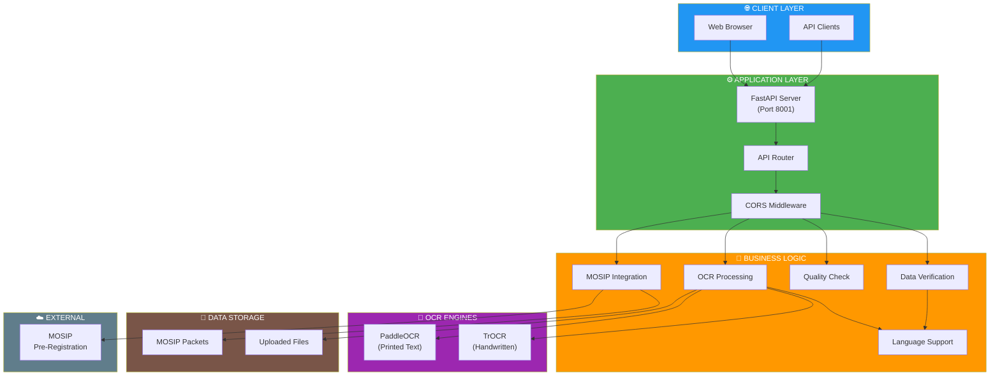
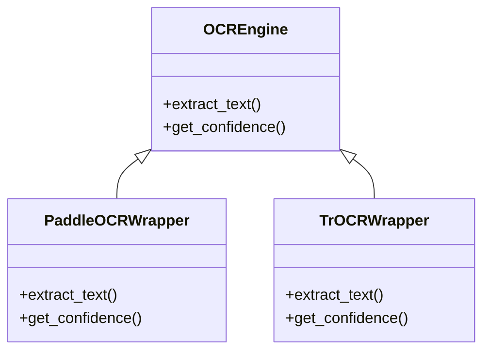
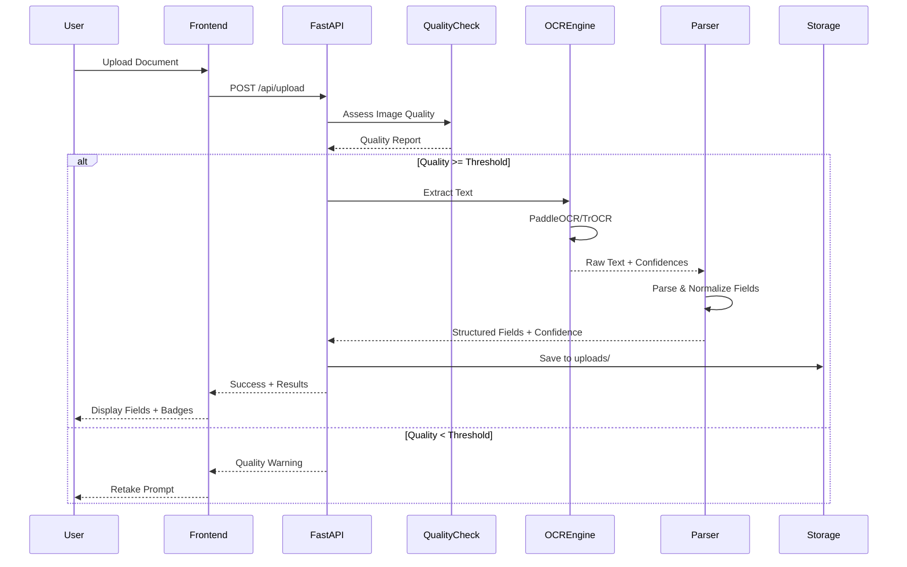
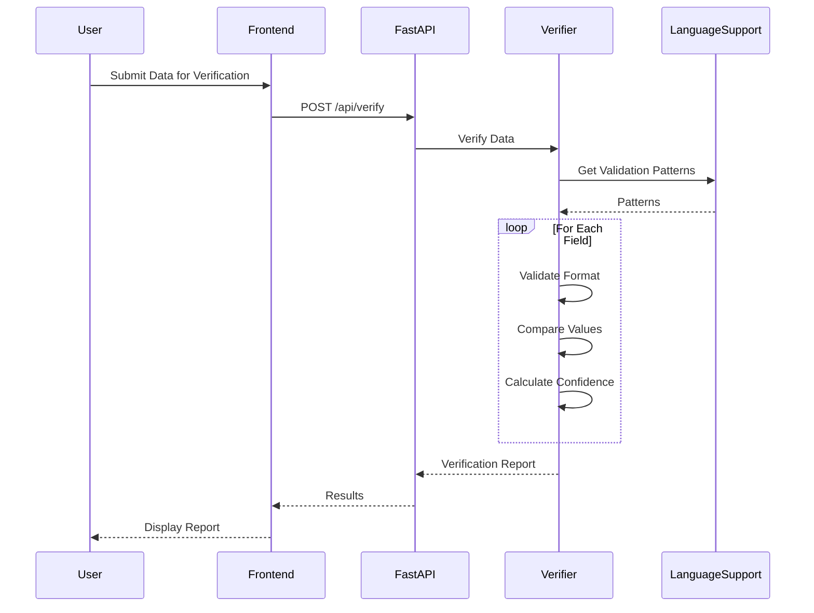
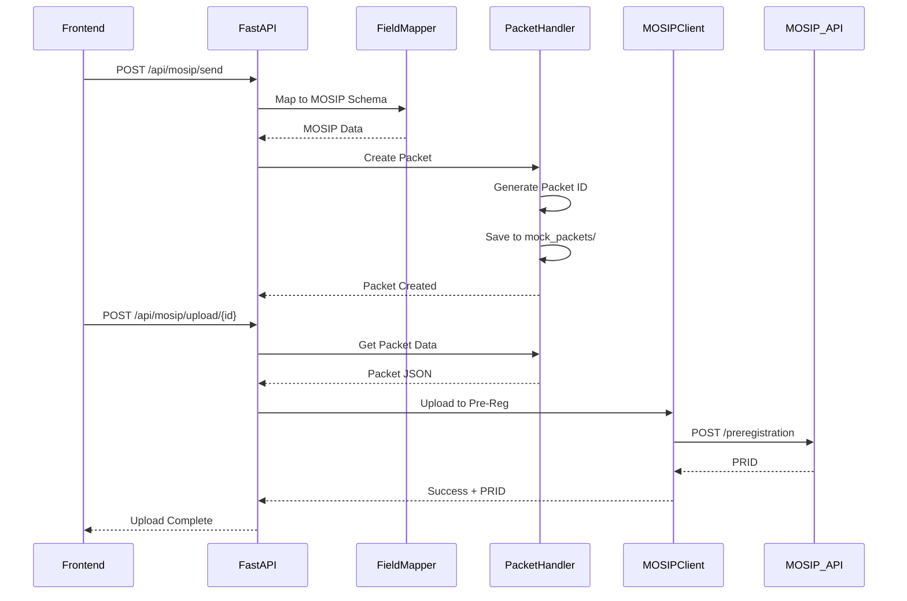

# Architectural Design Document
## OCR Text Extraction & Verification System

**Version:** 1.0.0  
**Date:** November 30, 2025  
**Status:** Production Ready

---

## Table of Contents

1. [Executive Summary](#executive-summary)
2. [System Architecture](#system-architecture)
3. [Component Design](#component-design)
4. [Data Flow Architecture](#data-flow-architecture)
5. [Technology Stack](#technology-stack)
6. [Design Patterns](#design-patterns)
7. [Security Architecture](#security-architecture)
8. [Scalability & Performance](#scalability--performance)
9. [Integration Architecture](#integration-architecture)

---

## 1. Executive Summary

### 1.1 System Overview

The OCR Text Extraction & Verification System is an enterprise-grade, multilingual document processing platform that provides intelligent optical character recognition, real-time confidence scoring, and seamless MOSIP identity platform integration.

**Key Capabilities:**
- Multi-Engine OCR (PaddleOCR, TrOCR, EasyOCR)
- Real-time confidence scoring with visual feedback
- Support for 3 languages (English, Arabic, Hindi)
- MOSIP Pre-Registration integration
- Quality-based document assessment
- RESTful API architecture

### 1.2 Design Principles

1. **Modularity** - Loosely coupled components with clear interfaces
2. **Extensibility** - Plugin architecture for OCR engines and languages
3. **Performance** - Asynchronous processing and caching strategies
4. **Reliability** - Error handling, fallback mechanisms, validation
5. **Maintainability** - Clean code, comprehensive logging, documentation

---

## 2. System Architecture

### 2.1 High-Level Architecture



### 2.2 Layered Architecture

| Layer | Responsibility | Key Components |
|-------|---------------|----------------|
| **Presentation** | User interface, API endpoints | `index.html`, FastAPI routes |
| **Application** | Request handling, routing | FastAPI app, middleware |
| **Business Logic** | Core functionality | OCR processing, verification |
| **Integration** | External services | MOSIP client, packet handler |
| **Data Access** | File I/O, persistence | Upload handling, packet storage |

---

## 3. Component Design

### 3.1 Core Components

#### 3.1.1 FastAPI Application (`app.py`)

**Responsibilities:**
- HTTP request handling
- Route management
- File upload processing
- Response serialization

**Key Features:**
- CORS middleware for cross-origin requests
- Multipart file upload support
- Static file serving
- Health check endpoints

**Architecture Pattern:** Model-View-Controller (MVC)

```python
# Pseudo-structure
class Application:
    def __init__(self):
        self.ocr_engine = OCREngine()
        self.verifier = OCRVerifier()
        self.quality_checker = QualityScore()
        
    @route("/api/upload")
    async def upload_document(file):
        quality = self.quality_checker.assess(file)
        if quality.overall < THRESHOLD:
            return quality_warning
        
        ocr_result = self.ocr_engine.extract(file)
        return ocr_result
```

#### 3.1.2 OCR Processing Module

**Components:**

1. **PaddleOCR Wrapper** (`paddle_ocr_module.py`)
   - Offline text extraction
   - Confidence scoring per detection
   - Multi-language support

2. **TrOCR Wrapper** (`trocr_handwritten.py`)
   - Handwritten text recognition
   - Transformer-based model
   - Line-level confidence scoring

3. **Text Parser** (`app.py::parse_trocr_direct_v2`)
   - Field normalization
   - Confidence mapping
   - Supports colonless formats

**Design Pattern:** Strategy Pattern (multiple OCR strategies)



#### 3.1.3 Verification Module (`ocr_verifier.py`)

**Responsibilities:**
- Data validation
- Format checking
- Comparison logic
- Confidence scoring

**Validation Layers:**
1. **Format Validation** - Email, phone, date formats
2. **Content Validation** - Length, character sets
3. **Cross-Reference** - Compare against original data
4. **Confidence Scoring** - Calculate match percentages

#### 3.1.4 Language Support (`language_support.py`)

**Architecture:** Multi-tenant language configuration

**Components:**
- Translation dictionaries (EN, AR, HI)
- Regex patterns per language
- Field type mappings
- OCR language codes

**Design Pattern:** Strategy + Factory Pattern

```python
class LanguageLoader:
    TRANSLATIONS = {
        'en': {...},
        'ar': {...},
        'hi': {...}
    }
    
    def get_regex_patterns(self) -> Dict:
        return self.REGEX_PATTERNS[self.current_language]
```

#### 3.1.5 MOSIP Integration Layer

**Components:**

1. **MOSIP Client** (`mosip_client.py`)
   - API communication
   - Authentication handling
   - Error recovery

2. **Field Mapper** (`mosip_field_mapper.py`)
   - Schema transformation
   - Field normalization

3. **Packet Handler** (`packet_handler.py`)
   - Packet creation
   - Local storage
   - Metadata management

**Pattern:** Adapter Pattern (OCR → MOSIP schema)

---

## 4. Data Flow Architecture

### 4.1 OCR Extraction Flow



### 4.2 Verification Flow



### 4.3 MOSIP Integration Flow



### 4.4 Request-Response Lifecycle

```
┌─────────────────────────────────────────────────────────────┐
│ 1. HTTP Request (Browser/API Client)                        │
└──────────────────┬──────────────────────────────────────────┘
                   ▼
┌─────────────────────────────────────────────────────────────┐
│ 2. FastAPI Middleware (CORS, Authentication)                │
└──────────────────┬──────────────────────────────────────────┘
                   ▼
┌─────────────────────────────────────────────────────────────┐
│ 3. Route Handler (Endpoint Function)                        │
│    - Parse request body/files                               │
│    - Validate inputs                                         │
└──────────────────┬──────────────────────────────────────────┘
                   ▼
┌─────────────────────────────────────────────────────────────┐
│ 4. Business Logic Layer                                     │
│    - Quality assessment                                     │
│    - OCR processing                                          │
│    - Verification                                            │
│    - MOSIP integration                                       │
└──────────────────┬──────────────────────────────────────────┘
                   ▼
┌─────────────────────────────────────────────────────────────┐
│ 5. Data Access Layer                                        │
│    - File I/O                                                │
│    - Packet storage                                          │
│    - Cache lookup                                            │
└──────────────────┬──────────────────────────────────────────┘
                   ▼
┌─────────────────────────────────────────────────────────────┐
│ 6. Response Serialization (JSON)                            │
└──────────────────┬──────────────────────────────────────────┘
                   ▼
┌─────────────────────────────────────────────────────────────┐
│ 7. HTTP Response (Status Code + Body)                       │
└─────────────────────────────────────────────────────────────┘
```

---

## 5. Technology Stack

### 5.1 Backend Technologies

| Technology | Version | Purpose |
|------------|---------|---------|
| **Python** | 3.10+ | Core language |
| **FastAPI** | Latest | Web framework |
| **Uvicorn** | Latest | ASGI server |
| **PaddlePaddle** | Latest | OCR engine |
| **PaddleOCR** | Latest | OCR wrapper |
| **PyTorch** | 2.6.0 | Deep learning |
| **Transformers** | ≥4.30.0 | TrOCR model |
| **OpenCV** | Latest | Image processing |
| **Pillow** | Latest | Image manipulation |
| **NumPy** | Latest | Numerical ops |
| **PyMuPDF** | Latest | PDF processing |

### 5.2 Frontend Technologies

| Technology | Purpose |
|------------|---------|
| **HTML5** | Structure |
| **CSS3** | Styling |
| **JavaScript (ES6+)** | Interactivity |
| **Alpine.js** | Reactive UI |
| **Fetch API** | HTTP requests |

### 5.3 Infrastructure

- **Storage:** Local file system (`uploads/`, `mock_packets/`)
- **Cache:** In-memory dictionaries
- **Protocol:** HTTP/HTTPS
- **Port:** 8001 (configurable)

---

## 6. Design Patterns

### 6.1 Architectural Patterns

1. **Layered Architecture**
   - Clear separation of concerns
   - Each layer depends only on the layer below

2. **RESTful API Design**
   - Resource-based URLs
   - HTTP methods (GET, POST)
   - JSON responses

3. **Microkernel Architecture**
   - Core system + plugins (OCR engines, languages)

### 6.2 Code-Level Patterns

| Pattern | Usage | Location |
|---------|-------|----------|
| **Strategy** | Multiple OCR engines | OCR modules |
| **Factory** | Language loader creation | `language_support.py` |
| **Adapter** | MOSIP field mapping | `mosip_field_mapper.py` |
| **Singleton** | OCR engine instances | Global variables |
| **Template Method** | Verification steps | `ocr_verifier.py` |

---

## 7. Security Architecture

### 7.1 Security Measures

1. **Input Validation**
   - File type verification
   - Size limits
   - Content sanitization

2. **CORS Protection**
   - Configured origins
   - Credential handling

3. **Data Sanitization**
   - Regex-based cleaning
   - Special character escaping

4. **Error Handling**
   - No sensitive data in errors
   - Generic error messages

### 7.2 Data Privacy

- **Local Processing** - No data sent to external servers (except MOSIP)
- **Temporary Storage** - Files cleaned up after processing
- **No Logging of PII** - Personal data not logged

---

## 8. Scalability & Performance

### 8.1 Performance Optimizations

1. **Asynchronous I/O** - FastAPI async endpoints
2. **Lazy Loading** - Models loaded on first use
3. **Caching** - In-memory cache for uploaded images
4. **Efficient Algorithms** - Optimized regex patterns

### 8.2 Scalability Considerations

**Horizontal Scaling:**
- Stateless API design
- Can deploy multiple instances behind load balancer

**Vertical Scaling:**
- GPU acceleration for TrOCR
- Memory tuning for large PDFs

### 8.3 Bottlenecks & Mitigation

| Bottleneck | Mitigation |
|------------|------------|
| TrOCR model loading | Singleton instance, lazy init |
| Large PDF processing | Page-by-page processing |
| Multiple simultaneous uploads | Async processing, queue system |

---

## 9. Integration Architecture

### 9.1 MOSIP Integration

**Integration Type:** REST API Client

**Endpoints Used:**
- `/preregistration` - Create pre-registration
- Authentication endpoints

**Data Flow:**
```
OCR Fields → Field Mapper → MOSIP Schema → Packet → API Upload
```

**Error Handling:**
- Retry logic with exponential backoff
- Fallback to local packet storage
- Detailed error logging

### 9.2 Extensibility Points

**Adding New OCR Engine:**
1. Create wrapper class implementing standard interface
2. Add to OCR engine initialization
3. Update comparison logic
4. Add UI selection option

**Adding New Language:**
1. Add translations to `language_support.py::TRANSLATIONS`
2. Add regex patterns to `REGEX_PATTERNS`
3. Add field types to `FIELD_TYPES`
4. Update `SUPPORTED_LANGUAGES`
5. Add UI dropdown option

**Adding New Verification Rule:**
1. Extend `ocr_verifier.py` with new validation function
2. Add to verification pipeline
3. Update confidence scoring logic

---

## Appendix A: System Metrics

**Code Statistics:**
- Lines of Python Code: ~8,000
- Lines of HTML/CSS/JS: ~3,700
- Number of API Endpoints: 12
- Supported Languages: 3
- Supported Field Types: 40+

**Performance Benchmarks:**
- Average OCR Time: 2-5 seconds
- Quality Assessment: <100ms
- Verification Time: <500ms
- MOSIP Packet Creation: <200ms

---

**Document Version:** 1.0.0  
**Last Updated:** November 30, 2024  
**Approved By:** Development Team
